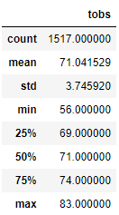

# surfs_up

## Challenge Overview
Aloha! In this module we have utilized Python (via Jupyter Notebook and VS Code), SQLAlchemy, and Flask to analyse and visualize meteoroliogical data from around the island of Oahu, Hawaii. We have done so to perform analyses to help understand the viability of giving up life in the Lower 48 and opening a surf shack/ice cream stand in paradise. We need to know if the weather will sustain business year-round to define the potential of this business endeavour.

Currently the weather data is stored in a SQLite database as a flat file, the befit of which is that the entire dataset can be stored locally. By developing a summary of the temperature data in both June and December, we can observe the hottest and coolest months to see if they match well with the consumption of ice cream and the catching of the gnarliest waves to make the most informed decisions possible.

## Results
### June Temperature Statistical Summary

### December Temperature Statistical Summary

The above images present the observed temperature data in Oahu for the months of June and December from 2010-2017, respectively. From the above data, we can see the following:
- The average temperature in June is 74.9 degrees fahrenheit and the average temperature in December is 71.0 degrees fahrenheit, nearly 4 degrees cooler.
- The maximum temperature observed in June was 85 degrees vs. 83 degrees in December. So, even if the days are cooler on average in December the peak temperatures remain similar in both months. The higher standard deviation observed in the December temperatures also indicates the greater variance in temperatures when compared to June.
- Most important to the ice cream business, a look at the mimimum observed temperatures indicates an obversved gap of 8 degrees between June (64 degrees) and December (56 degrees). This, coupled with the lower quartile data showing that 25% of days only reach 69 degrees in December vs. 73 degrees in June indicate that there are certainly going to be days where ice cream isn't a highly sought-after treat. It may be a good idea to ensure the surf shack has a well-stocked inventory of wetsuits and cooler weather surfing accessories as well.

## Summary
